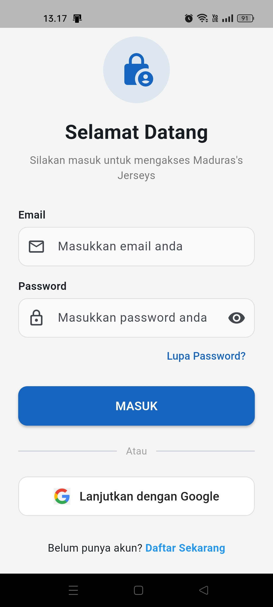
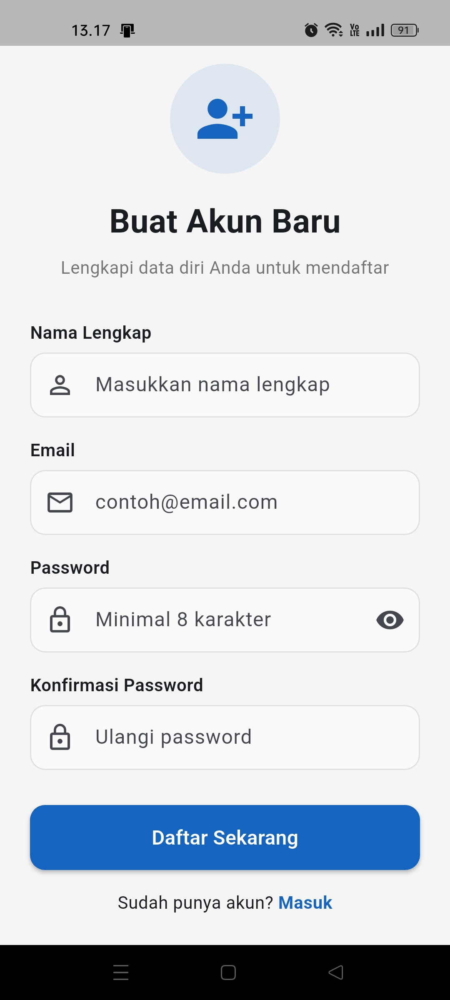
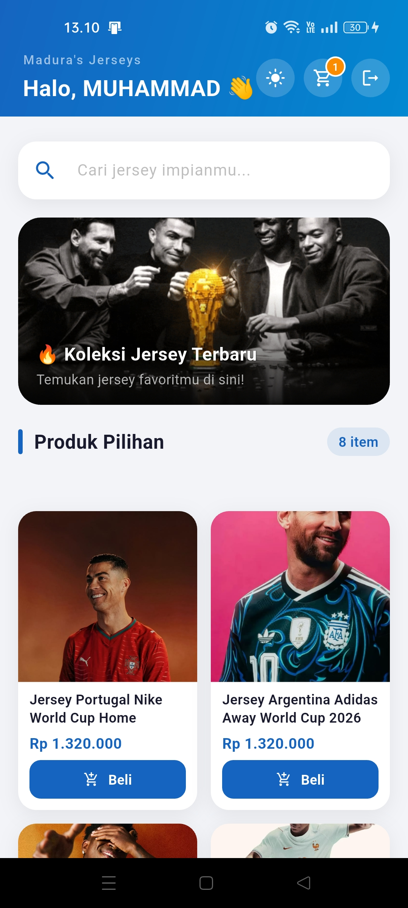
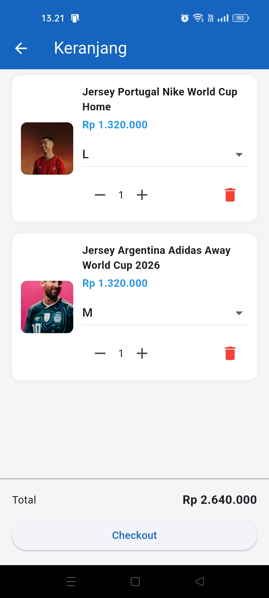
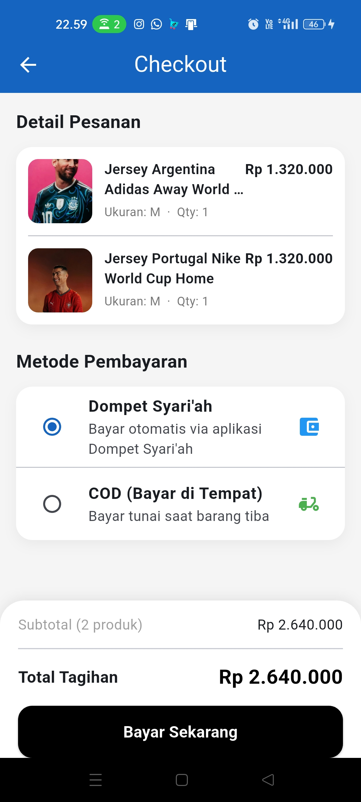
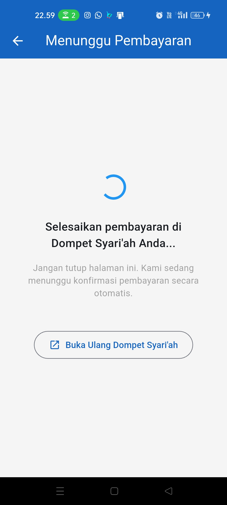
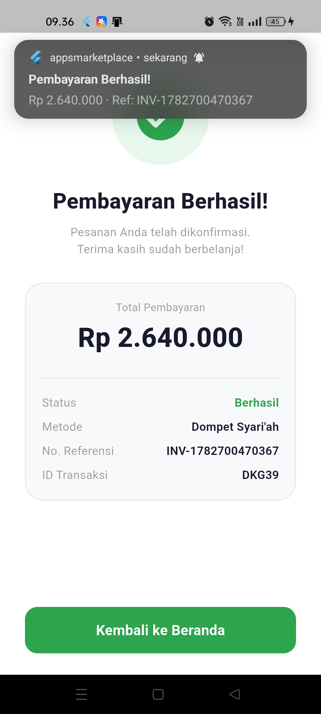

# Toko Jersey — AppsMarketplace

**Aplikasi Mobile Marketplace Jersey Berbasis Flutter**

---

## Identitas Mahasiswa

| Field | Detail |
|-------|--------|
| Nama | MUHAMMAD ILHAM MAULANA |
| NIM | 1123150141 |
| Kelas | TI 23 SH SE |
| Mata Kuliah | Aplikasi Mobile Lanjutan — Semester 6 |

---

## Deskripsi Aplikasi

**AppsMarketplace** adalah aplikasi mobile toko jersey berbasis Flutter yang memungkinkan pengguna untuk menelusuri produk, mengelola keranjang belanja, dan melakukan pembayaran secara digital melalui integrasi dengan aplikasi **Dompet Syar'iah (E-Money)**.

### Fitur Utama

- **Autentikasi** — Login & Register menggunakan Email/Password dan Google Sign-In melalui Firebase Authentication, dengan verifikasi email wajib sebelum login
- **Katalog Produk** — Menampilkan daftar produk jersey dari backend API dengan detail harga, ukuran, dan gambar
- **Keranjang Belanja** — Tambah, ubah jumlah, dan hapus item dari keranjang; sinkronisasi real-time dengan backend
- **Checkout** — Pilihan metode pembayaran: Dompet Syari'ah (E-Money) atau COD (bayar di tempat)
- **Pembayaran Deep Link** — Integrasi dengan aplikasi Dompet Syari'ah menggunakan deep link `dompetsyariah://pay` untuk pembayaran otomatis tanpa input manual
- **Status Transaksi** — Halaman konfirmasi transaksi dengan detail pembayaran (jumlah, referensi, ID transaksi) setelah pembayaran berhasil
- **Notifikasi Lokal** — Notifikasi otomatis di status bar saat pembayaran dikonfirmasi oleh E-Money

---

## Arsitektur Aplikasi

### Gambaran Umum Sistem

```
┌────────────────────────────────────────────────────┐
│              EKOSISTEM APLIKASI                     │
│                                                     │
│  ┌──────────────────┐      ┌────────────────────┐  │
│  │  AppsMarketplace │      │  Dompet Syari'ah   │  │
│  │  (Flutter/       │◄────►│  (E-Money/BLoC)    │  │
│  │   Provider)      │      │  (Flutter/BLoC)    │  │
│  └────────┬─────────┘      └────────────────────┘  │
│           │ REST API              Deep Link          │
│           ▼                                         │
│  ┌──────────────────┐                               │
│  │   Go Backend     │                               │
│  │  (Gin + GORM)    │                               │
│  └────────┬─────────┘                               │
│           │                                         │
│  ┌────────▼─────────┐   ┌─────────────────────┐   │
│  │  MySQL Database  │   │  Firebase Auth       │   │
│  └──────────────────┘   └─────────────────────┘   │
└────────────────────────────────────────────────────┘
```

### Alur Pembayaran Deep Link

```
AppsMarketplace                     E-Money (Dompet Syari'ah)
      │                                      │
      │  dompetsyariah://pay?amount=X         │
      │  &merchant_id=JERSEY_STORE_01        │
      │  &reference=INV-xxx                  │
      │  &callback=appsmarketplace://...     │
      │─────────────────────────────────────►│
      │                                      │ User konfirmasi
      │                                      │ PIN & bayar
      │  appsmarketplace://payment-result    │
      │  ?status=success&amount=X            │
      │  &reference=INV-xxx                  │
      │  &transaction_id=DKGxxx              │
      │◄─────────────────────────────────────│
      │                                      │
   [Notifikasi + Halaman Status Transaksi]
```

### Struktur Folder AppsMarketplace

```
appsmarketplace/
├── lib/
│   ├── core/
│   │   ├── constants/       # API constants
│   │   ├── features/
│   │   │   ├── auth/        # Login, Register, Verify Email
│   │   │   ├── cart/        # Cart Provider & Pages
│   │   │   └── dashboard/   # Product listing & Provider
│   │   ├── routes/          # AppRouter & SplashPage
│   │   └── services/
│   │       ├── auth_provider.dart          # Firebase Auth state
│   │       ├── global_institute_pay_service.dart  # Deep link handler
│   │       └── notification_service.dart   # Local notifications
│   ├── app.dart
│   └── main.dart
├── android/
│   └── app/src/main/AndroidManifest.xml   # Deep link intent-filter
└── pubspec.yaml
```

### Struktur Folder Backend (Go)

```
backend/
├── config/           # Firebase & Database init
├── controllers/      # Handler HTTP (auth, product, cart, order)
├── middleware/       # JWT Auth middleware
├── models/           # GORM models
├── routes/           # Route definitions
├── deploy.sh         # VPS deploy script
└── main.go
```

### State Management

| Komponen | Pattern |
|----------|---------|
| AppsMarketplace | Provider (ChangeNotifier) |
| E-Money App | BLoC (flutter_bloc) |

---

## Cara Menjalankan Proyek

### Prasyarat

- Flutter SDK >= 3.9.2
- Android Studio / VS Code
- Go >= 1.21 (untuk backend)
- MySQL / MariaDB
- File `google-services.json` dari Firebase Console
- File `firebase-service-account.json` untuk backend

### 1. Clone Repository

```bash
git clone https://github.com/IlhamMaulana13/UTSApps-MarketPlace.git
cd UTSApps-MarketPlace
```

### 2. Menjalankan Backend (Go)

```bash
cd backend

# Salin dan isi environment variables
cp .env.example .env
# Edit .env: isi DB_HOST, DB_USER, DB_PASSWORD, DB_NAME, JWT_SECRET
# Letakkan firebase-service-account.json di folder backend/

# Install dependensi & jalankan
go mod tidy
go run main.go
# Backend berjalan di http://localhost:8080
```

### 3. Menjalankan AppsMarketplace (Flutter)

```bash
cd appsmarketplace

# Install dependensi Flutter
flutter pub get

# Salin google-services.json ke android/app/
# cp path/to/google-services.json android/app/

# Sesuaikan IP backend di:
# lib/core/constants/api_constants.dart
# static const String baseUrl = 'http://<IP_LAPTOP>:8080/v1';

# Jalankan di perangkat/emulator
flutter run
```

### 4. Konfigurasi Deep Link (Android)

Pastikan `AndroidManifest.xml` sudah memiliki intent-filter untuk skema `appsmarketplace`:

```xml
<intent-filter android:autoVerify="true">
    <action android:name="android.intent.action.VIEW" />
    <category android:name="android.intent.category.DEFAULT" />
    <category android:name="android.intent.category.BROWSABLE" />
    <data android:scheme="appsmarketplace" android:host="payment-result" />
</intent-filter>
```

### 5. Build APK

```bash
cd appsmarketplace
flutter build apk --release
# APK tersedia di: build/app/outputs/flutter-apk/app-release.apk
```

---

## Daftar Dependensi Utama

### AppsMarketplace (Flutter)

| Package | Versi | Fungsi |
|---------|-------|--------|
| `flutter` | SDK | Framework UI utama |
| `provider` | ^6.1.5 | State management (ChangeNotifier) |
| `firebase_core` | ^3.6.0 | Inisialisasi Firebase |
| `firebase_auth` | ^5.3.1 | Autentikasi pengguna |
| `google_sign_in` | ^6.2.1 | Login dengan akun Google |
| `dio` | ^5.7.0 | HTTP client untuk REST API |
| `flutter_secure_storage` | ^9.2.2 | Penyimpanan token JWT secara aman |
| `url_launcher` | ^6.3.1 | Membuka deep link ke aplikasi E-Money |
| `app_links` | ^6.3.2 | Menangkap incoming deep link dari E-Money |
| `flutter_local_notifications` | ^18.0.1 | Notifikasi lokal saat pembayaran berhasil |
| `email_validator` | ^3.0.0 | Validasi format email |
| `flutter_svg` | ^2.0.10 | Render ikon SVG (logo Google) |
| `equatable` | ^2.0.5 | Value equality untuk model |

### Backend (Go)

| Package | Fungsi |
|---------|--------|
| `gin-gonic/gin` | HTTP web framework |
| `gorm.io/gorm` | ORM untuk MySQL |
| `firebase.google.com/go` | Firebase Admin SDK (verifikasi token) |
| `golang-jwt/jwt` | Pembuatan & validasi JWT |
| `joho/godotenv` | Membaca file `.env` |

---

## Screenshot Aplikasi

### Halaman Login & Register
> Login dengan Email/Password atau Google Sign-In. Register dengan verifikasi email otomatis.

| Login | Register |
|-------|----------|
| ** | ** |

### Katalog Produk & Keranjang
> Daftar produk dari backend, dapat ditambahkan ke keranjang dengan pilihan ukuran.

| Dashboard Produk | Keranjang Belanja |
|-----------------|-------------------|
| ** | ** |

### Alur Pembayaran
> Checkout → E-Money (Dompet Syari'ah) → Konfirmasi PIN → Kembali ke Toko.

| Checkout | Menunggu Bayar | Status Transaksi & Notifikasi|
|----------|---------------|-----------------|
| ** | ** | ** |

---

## Link Video Presentasi

[](https://youtu.be/D-VOZLVeKzw?si=KYH_O2BDZiuk1EXJ)

**Link:** https://youtu.be/D-VOZLVeKzw?si=KYH_O2BDZiuk1EXJ

---

## Catatan Teknis

### Konfigurasi IP Backend

Saat menjalankan di perangkat fisik, pastikan IP di `api_constants.dart` sesuai dengan IP laptop dalam jaringan yang sama (WiFi):

```dart
// lib/core/constants/api_constants.dart
static const String baseUrl = 'http://192.168.x.x:8080/v1';
```

### Izin Android yang Diperlukan

```xml
<uses-permission android:name="android.permission.INTERNET" />
<uses-permission android:name="android.permission.POST_NOTIFICATIONS" />
<uses-permission android:name="android.permission.VIBRATE" />
```

### Versi Android Minimum

- **minSdk**: 21 (Android 5.0 Lollipop)
- **targetSdk**: sesuai Flutter SDK terbaru
- **compileSdk**: sesuai Flutter SDK terbaru

---

*Institut Teknologi & Bisnis Bina Sarana Global*
